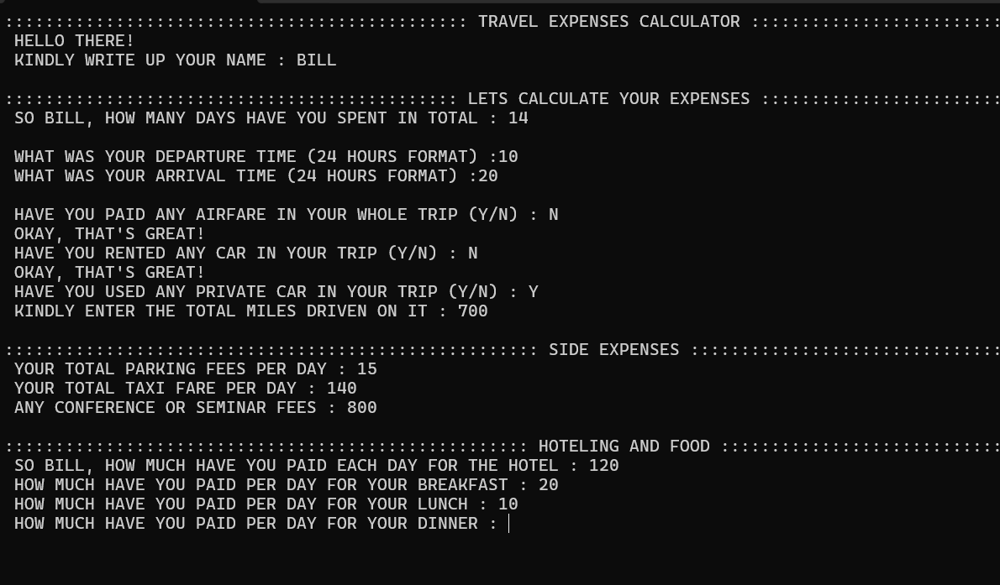
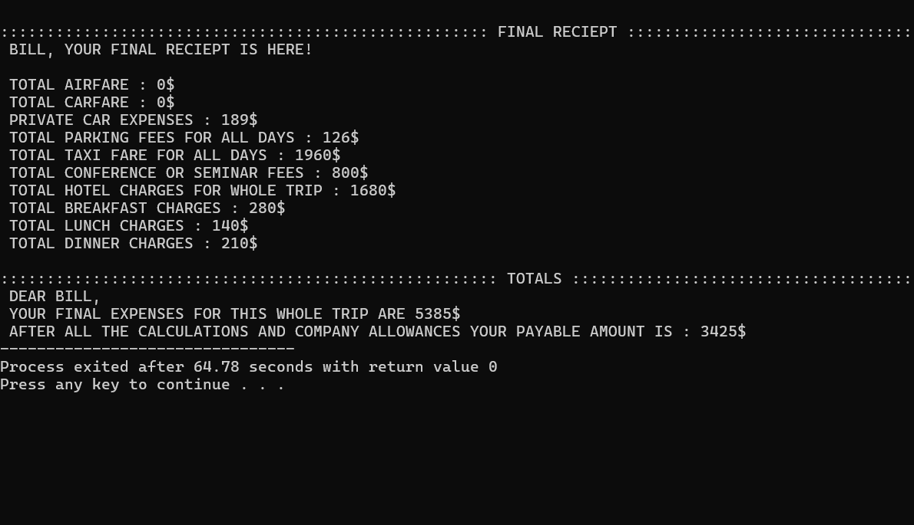

# 🧳 Travel Expenses Calculator (C++)

A console-based **Travel Expense Calculator** built in C++.
This program helps users calculate their **trip expenses** by taking inputs such as airfare, car rentals, private car mileage, parking, taxi, seminar fees, hotel, and meals. It then generates a **detailed receipt** with company allowances and shows both **total and payable expenses**.

---

## ✨ Features

* **User-Friendly Input System**

  * Collects name, trip duration, departure and arrival times.
* **Expense Categories**

  * Airfare, Car Rentals, Private Car (mileage), Parking Fees, Taxi Fare, Seminar/Conference Fees.
* **Hotel & Food Tracking**

  * Hotel charges, daily breakfast, lunch, and dinner costs.
* **Detailed Receipt**

  * Shows individual expenses, totals, and allowances.
* **Allowance Adjustments**

  * Applies company policy deductions (parking, taxi, hotel, meals).
* **Final Payable Amount**

  * Displays total expenses and the adjusted payable amount.

---

## 🛠️ Technologies Used

* **Language**: C++
* **Libraries**:

  * `<iostream>` (input/output)
  * `<string>` (string handling)

---

## 🚀 How to Run

1. Clone the repository:

   ```bash
   git clone https://github.com/your-username/Travel_Expenses_Calculator.git
   cd Travel_Expenses_Calculator
   ```

2. Compile the program:

   ```bash
   g++ main.cpp -o Travel_Expenses_Calculator
   ```

3. Run the executable:

   ```bash
   ./Travel_Expenses_Calculator
   ```

---

## 📸 Sample Output

```
:::::::::::::::::::::::::::::::::::::::::::::: TRAVEL EXPENSES CALCULATOR ::::::::::::::::::::::::::::::::::::::::::::::

 HELLO THERE!
 KINDLY WRITE UP YOUR NAME : Bilal

::::::::::::::::::::::::::::::::::::::::::::: LETS CALCULATE YOUR EXPENSES :::::::::::::::::::::::::::::::::::::::::::::

 SO Bilal, HOW MANY DAYS HAVE YOU SPENT IN TOTAL : 5
 WHAT WAS YOUR DEPARTURE TIME (24 HOURS FORMAT) : 10
 WHAT WAS YOUR ARRIVAL TIME (24 HOURS FORMAT) : 22
```

---

## 🖼️ Screenshots / Preview


Example:


---



---

## 📚 Learning Outcomes

This project helps beginners practice:

* Control structures (loops, conditions, labels)
* Input validation
* Functions and decomposition (scope expansion)
* Menu-driven console programs
* Handling real-world use cases with logic

---

## 👨‍💻 Author

Developed by **Bilal Asif**

---
